<div align="center">

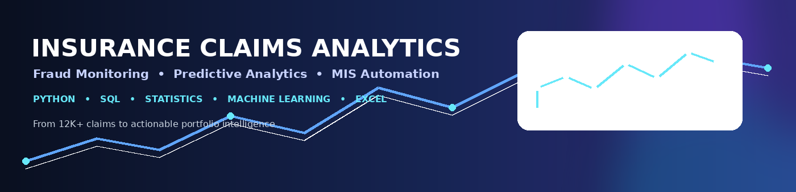

<br><br>

[](https://www.python.org/)
[](https://www.postgresql.org/)
[](https://pandas.pydata.org/)
[](https://scikit-learn.org/)
[](https://www.microsoft.com/microsoft-365/excel)

### End-to-End Insurance Analytics Project

**Claims Intelligence → Fraud Monitoring → Predictive Risk → Management Reporting**

</div>

---

## 📊 Project at a Glance

| **12,002** | **11,994** | **24.6%** | **0.63** | **11** |
|:---:|:---:|:---:|:---:|:---:|
| Claims | Known Outcomes | Reported Fraud | ROC-AUC | Visuals |

This project demonstrates an end-to-end **insurance claims analytics workflow** using the Minitab Insurance Fraud dataset.

The goal is to transform raw claims data into decision-ready insights through:

- 📈 Portfolio and claims analytics
- 🔎 Fraud-rate segmentation
- 📐 Statistical diagnostics
- 🤖 Predictive modelling
- 🗄️ SQL-based KPI monitoring
- 📊 Automated Excel MIS reporting
- 🎯 Presentation-ready business visualisations

---

# 💡 Why This Project Matters

Insurance analytics teams need to answer questions such as:

| Business Question | Analytical Approach |
|---|---|
| Where is claim exposure concentrated? | Claim-value & portfolio segmentation |
| Which channels show higher fraud exposure? | Channel-level fraud-rate analysis |
| Does claim severity relate to fraud? | Severity-band segmentation |
| Where do operational patterns differ? | Accident-site & processing analysis |
| Can claims be prioritised for review? | Fraud-risk probability modelling |
| How can management monitor the portfolio? | SQL KPIs + automated Excel MIS |

---

# 🧰 Technology Stack

| Area | Tools |
|---|---|
| 🐍 Programming | Python |
| 🔢 Data Manipulation | Pandas, NumPy |
| 📐 Statistical Analysis | Descriptive statistics, correlations, diagnostics |
| 🤖 Machine Learning | Scikit-learn |
| 📊 Visualisation | Matplotlib |
| 🗄️ Database Analytics | SQL |
| 📑 Reporting | Microsoft Excel |
| 📓 Development | Jupyter Notebook |
| 🔗 Version Control | Git / GitHub |

---

# 🔄 Analytical Workflow

<div align="center">

**🟦 RAW CLAIMS DATA**  
↓  
**🟩 DATA QUALITY & PREPARATION**  
↓  
**🟦 EDA & PORTFOLIO ANALYTICS**  
↓  
**🟧 FRAUD & SEVERITY SEGMENTATION**  
↓  
**🟪 PREDICTIVE RISK MODELLING**  
↓  
**🟩 SQL KPI MONITORING**  
↓  
**🟧 AUTOMATED MIS REPORTING**

</div>

### Workflow Components

1. **Data Quality & Preparation**
   - Date parsing and standardisation
   - Numeric conversion
   - Missing-value treatment
   - Fraud outcome encoding
   - Claim-month and severity-band creation

2. **Portfolio Analytics**
   - Claim volume and claim-value analysis
   - Channel segmentation
   - Accident-site segmentation
   - Vehicle-category analysis
   - Monthly monitoring

3. **Fraud Analytics**
   - Fraud-rate segmentation
   - Severity-band analysis
   - Accident-site × channel analysis
   - Claim-value concentration

4. **Predictive Modelling**
   - Stratified train/test split
   - Numerical imputation and standardisation
   - Categorical one-hot encoding
   - Class-weighted Logistic Regression
   - ROC-AUC and precision–recall evaluation

5. **Reporting & Automation**
   - SQL KPI layer
   - Automated Excel MIS workbook
   - Reusable Python scripts

---

# 🎨 Visual Analytics

## 01 · Executive Portfolio View

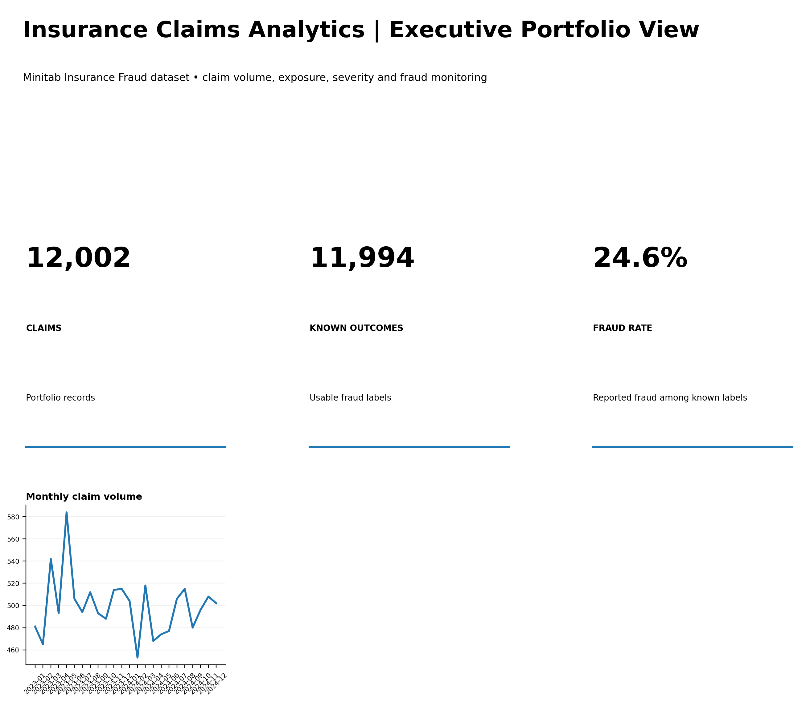

---

## 02 · Fraud Exposure by Channel

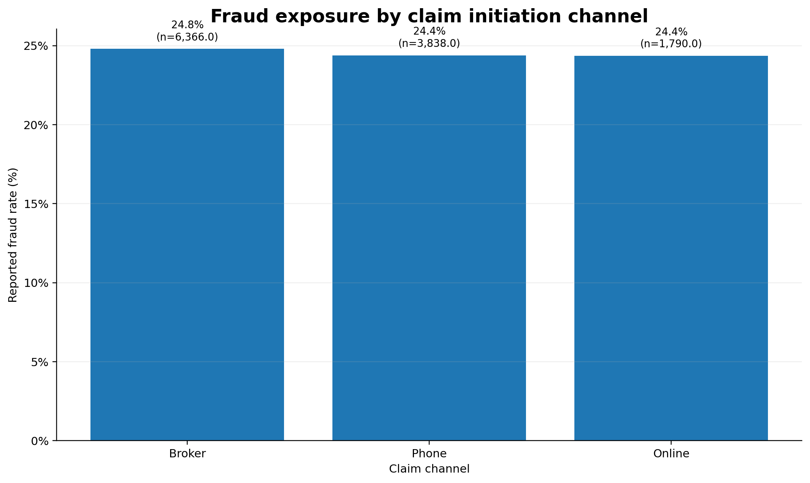

---

## 03 · Claim Amount Distribution

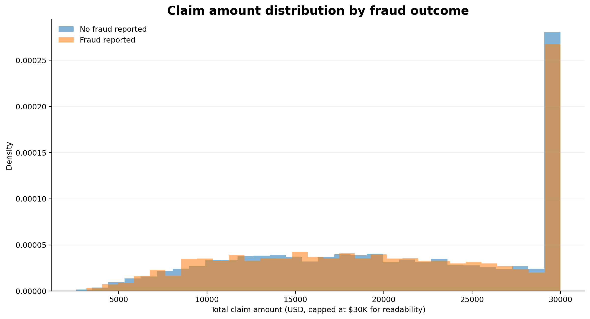

---

## 04 · Fraud Rate Across Claim Severity

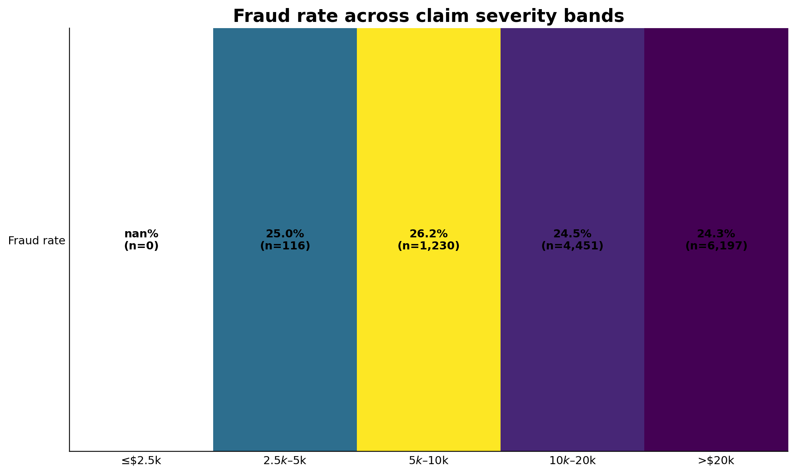

---

## 05 · Accident Site × Claim Channel

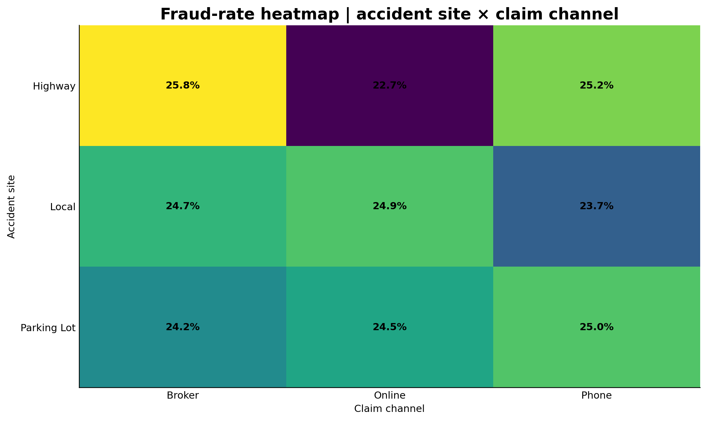

---

## 06 · Monthly Portfolio Monitoring

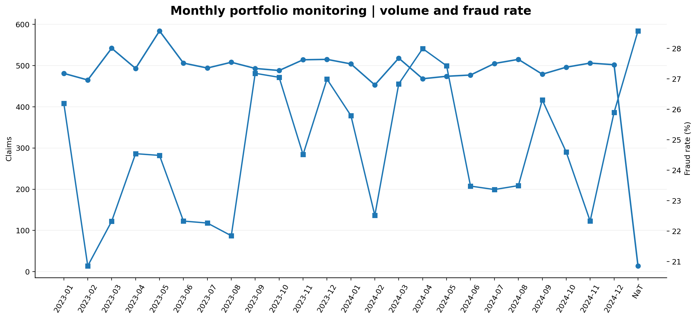

---

## 07 · Operational Processing Duration

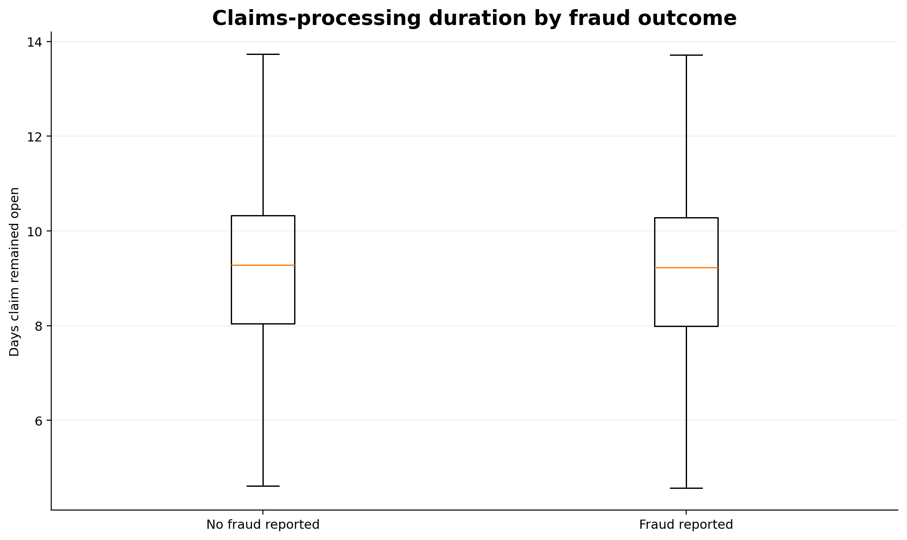

---

## 08 · Numeric Driver Correlation Matrix

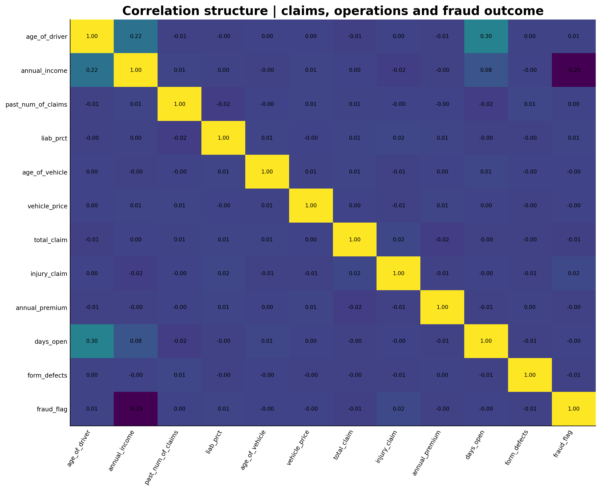

---

# 🤖 Predictive Analytics

## Fraud-Risk Model

A **class-weighted Logistic Regression** model was developed as a baseline fraud-risk scoring framework.

### Modelling Pipeline

```text
Raw Features
     ↓
Missing-Value Treatment
     ↓
Numerical Standardisation + Categorical One-Hot Encoding
     ↓
Class-Weighted Logistic Regression
     ↓
Fraud Probability Score
     ↓
ROC-AUC + Precision–Recall Evaluation
```

### Model Performance

| Metric | Result |
|---|---:|
| Model | Logistic Regression |
| ROC-AUC | **0.63** |
| Target | Fraud Reported |
| Validation | Stratified Train/Test Split |
| Class Handling | Balanced Class Weights |

### Model Evaluation

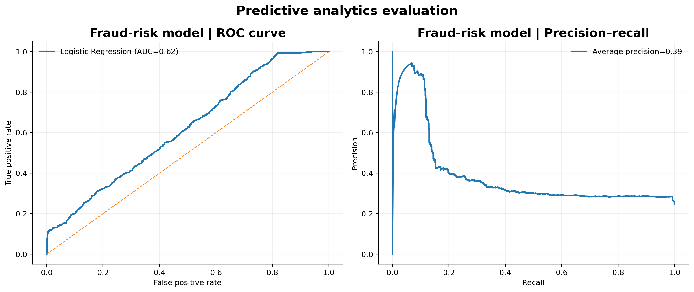

### Predicted Risk Score Distribution

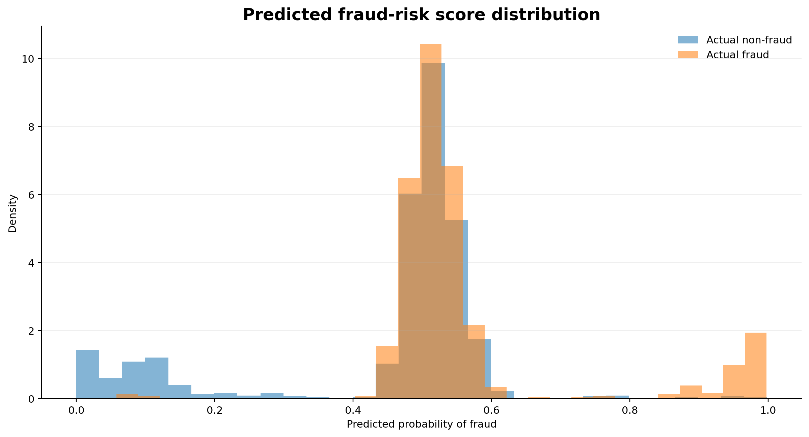

> **Interpretation:** This is intentionally presented as a baseline analytical model rather than a production fraud engine. The purpose is to demonstrate the complete workflow from claims data to risk scoring.

---

# 💰 Portfolio Risk Analytics

## Claim-Value Concentration

The Pareto analysis examines how claim value is distributed across the portfolio and supports prioritisation of high-value exposures.

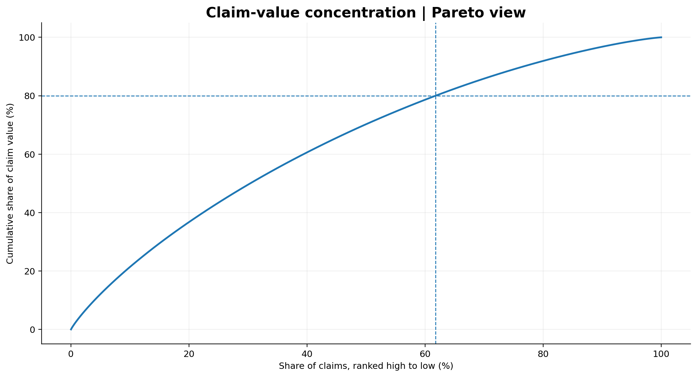

---

# 🗄️ SQL Analytics

The SQL layer contains reusable queries for:

- Portfolio-level KPIs
- Channel performance
- Accident-site exposure
- High-value claim segmentation
- Monthly monitoring
- Claims-processing efficiency
- Window-function based ranking

### Example

```sql
SELECT
    channel,
    COUNT(*) AS claim_count,
    AVG(total_claim) AS avg_claim_amount,
    AVG(fraud_flag) * 100 AS fraud_rate_pct
FROM insurance_claims
GROUP BY channel
ORDER BY fraud_rate_pct DESC;
```

---

# 📊 Automated MIS Reporting

The project includes an **Excel MIS workbook generated through Python**.

### Reporting Views

```text
                    EXECUTIVE KPIs
                          │
          ┌───────────────┼───────────────┐
          ↓               ↓               ↓
   CHANNEL ANALYSIS  ACCIDENT SITE   VEHICLE CATEGORY
          │               │               │
          └───────────────┼───────────────┘
                          ↓
                  MONTHLY TREND
                          ↓
                   SEVERITY BANDS
```

This demonstrates the transition from:

**Raw Data → Analysis → KPI Layer → Management Reporting**

---

# 🧹 Data Preparation

The data preparation layer includes:

- Date parsing and standardisation
- Numeric conversion
- Missing-value treatment
- Fraud outcome encoding
- Claim-month creation
- Claim severity bands
- Derived claim ratios
- Outlier-aware analytical preparation

---

# 📁 Repository Structure

```text
Insurance-claims-analytics/
│
├── README.md
├── insurance_analytics_banner.png
│
├── Insurance_Fraud_Analytics.ipynb
├── Insurance_Fraud_MIS.xlsx
├── RECRUITER_PROJECT_SUMMARY.md
│
├── insurance_fraud_data.csv
├── insurance_fraud_clean.csv
├── data_dictionary.csv
│
├── insurance_fraud_analysis.sql
├── fraud_model.py
├── generate_mis.py
├── requirements.txt
│
├── 00_executive_portfolio_overview.png
├── 01_fraud_exposure_by_channel.png
├── 02_claim_amount_distribution_by_fraud.png
├── 03_fraud_rate_by_claim_severity.png
├── 04_accident_site_channel_heatmap.png
├── 05_monthly_volume_and_fraud_rate.png
├── 06_processing_duration_by_fraud.png
├── 07_numeric_driver_correlation_matrix.png
├── 08_model_roc_and_precision_recall.png
├── 09_predicted_risk_score_distribution.png
└── 10_claim_value_pareto.png
```

---

# 🎯 Key Takeaways

### 01 — Portfolio Monitoring
Claims can be segmented across channel, accident site, vehicle characteristics, severity and time to identify areas requiring management attention.

### 02 — Fraud Analytics
Fraud-rate segmentation provides a structured framework for comparing exposure across operational and claim characteristics.

### 03 — Predictive Analytics
Claim-level variables can be transformed into probability-based fraud-risk scores using supervised learning.

### 04 — Management Reporting
SQL KPIs and automated Excel reporting bridge the gap between analytical work and recurring business monitoring.

---

# 📌 Source

**Dataset:** Minitab Insurance Fraud dataset.

Official documentation:  
https://support.minitab.com/en-us/minitab-solution-center/getting-started-tutorials/dataset-description/

This is an academic / portfolio analytics project using a public dataset. The predictive model is a baseline analytical model and is **not intended for production claims adjudication or fraud-decision deployment** without further validation, governance and domain review.

---

<div align="center">

### Built by Anmol

**M.A. Applied Quantitative Finance · Madras School of Economics**

[GitHub](https://github.com/Anmol-1804) · [LinkedIn](https://www.linkedin.com/in/anmol1804)

</div>
