<div align="center">

<a href="https://github.com/Anmol-1804/Insurance-claims-analytics">

</a>

<br>

[](https://www.python.org/)
[](https://www.postgresql.org/)
[](https://pandas.pydata.org/)
[](https://scikit-learn.org/)
[](https://www.microsoft.com/microsoft-365/excel)
[](https://github.com/Anmol-1804)

### End-to-End Insurance Analytics Project

**Claims Intelligence → Fraud Monitoring → Predictive Risk → Management Reporting**

</div>

---

## Project Overview

This project demonstrates an end-to-end **insurance claims analytics workflow** using the Minitab Insurance Fraud dataset.

The objective is to transform raw claims data into decision-ready insights through:

- Portfolio and claims analytics
- Fraud-rate segmentation
- Statistical diagnostics
- Predictive modelling
- SQL-based KPI monitoring
- Automated Excel MIS reporting
- Presentation-ready business visualisations

> **Dataset scale:** 12,002 claims  
> **Known fraud outcomes:** 11,994  
> **Reported fraud rate:** 24.6%

---

## Why This Project Matters

Insurance analytics teams need to answer questions such as:

| Business Question | Analytical Approach |
|---|---|
| Where is claim exposure concentrated? | Claim-value & portfolio segmentation |
| Which channels show higher fraud exposure? | Channel-level fraud-rate analysis |
| Does claim severity relate to fraud? | Severity-band segmentation |
| Where do operational patterns differ? | Accident-site & processing analysis |
| Can claims be prioritised for review? | Fraud-risk probability modelling |
| How can management monitor the portfolio? | SQL KPIs + automated Excel MIS |

---

## Project Highlights

<div align="center">

| 12,002 | 24.6% | 0.63 | 11 |
|:---:|:---:|:---:|:---:|
| **Claims Analysed** | **Reported Fraud Rate** | **ROC-AUC** | **Analytics Visuals** |

</div>

### Core Capabilities

- **Data Analytics:** cleaning, transformation, segmentation and exploratory analysis
- **Statistical Analysis:** distributions, correlations and fraud-rate diagnostics
- **Predictive Analytics:** class-weighted Logistic Regression
- **SQL:** portfolio KPIs, segmentation, window functions and monitoring queries
- **MIS Automation:** Python-generated Excel reporting workflow
- **Business Visualisation:** executive dashboards, heatmaps, trend analysis and model diagnostics

---

## Technology Stack

| Area | Tools |
|---|---|
| Programming | Python |
| Data Manipulation | Pandas, NumPy |
| Statistical Analysis | SciPy / descriptive statistics |
| Machine Learning | Scikit-learn |
| Visualisation | Matplotlib |
| Database Analytics | SQL |
| Reporting | Microsoft Excel |
| Development | Jupyter Notebook |
| Version Control | Git / GitHub |

---

# Analytical Workflow

```mermaid
flowchart LR
    A["Raw Claims Data<br/>12,002 Records"] --> B["Data Quality<br/>& Preparation"]
    B --> C["EDA &<br/>Portfolio Analytics"]
    C --> D["Fraud &<br/>Severity Segmentation"]
    D --> E["Predictive<br/>Risk Modelling"]
    E --> F["SQL KPI<br/>Monitoring"]
    F --> G["Automated MIS<br/>Reporting"]

    style A fill:#172554,stroke:#60A5FA,color:#FFFFFF
    style B fill:#0F766E,stroke:#2DD4BF,color:#FFFFFF
    style C fill:#0369A1,stroke:#38BDF8,color:#FFFFFF
    style D fill:#7C2D12,stroke:#FB923C,color:#FFFFFF
    style E fill:#581C87,stroke:#C084FC,color:#FFFFFF
    style F fill:#166534,stroke:#4ADE80,color:#FFFFFF
    style G fill:#9A3412,stroke:#FDBA74,color:#FFFFFF
```

<div align="center">



</div>

---

# Visual Analytics

## Executive Portfolio View

<p align="center">

</p>

---

## Fraud Exposure by Channel

<p align="center">

</p>

---

## Claim Amount Distribution

<p align="center">

</p>

---

## Fraud Rate Across Claim Severity

<p align="center">

</p>

---

## Accident Site × Claim Channel

<p align="center">

</p>

---

## Monthly Portfolio Monitoring

<p align="center">

</p>

---

## Operational Processing Duration

<p align="center">

</p>

---

## Numeric Driver Correlation Matrix

<p align="center">

</p>

---

# Predictive Analytics

## Fraud-Risk Model

A **class-weighted Logistic Regression** model was developed as a baseline fraud-risk scoring framework.

### Modelling Pipeline

```text
Raw Features
     ↓
Missing-value Treatment
     ↓
Numerical Standardisation
     +
Categorical One-Hot Encoding
     ↓
Class-Weighted Logistic Regression
     ↓
Fraud Probability Score
     ↓
ROC-AUC / Precision–Recall Evaluation
```

### Model Performance

| Metric | Result |
|---|---:|
| Model | Logistic Regression |
| ROC-AUC | **0.63** |
| Target | Fraud Reported |
| Validation | Stratified Train/Test Split |
| Class Handling | Balanced Class Weights |

<p align="center">

</p>

### Risk Score Distribution

<p align="center">

</p>

---

# Portfolio Risk Analytics

## Claim-Value Concentration

The Pareto analysis highlights how claim value is distributed across the portfolio and supports prioritisation of high-value exposures.

<p align="center">

</p>

---

# SQL Analytics

The SQL layer contains reusable queries for:

- Portfolio-level KPIs
- Channel performance
- Accident-site exposure
- High-value claim segmentation
- Monthly monitoring
- Claims-processing efficiency
- Window-function based ranking

Example analytical pattern:

```sql
SELECT
    channel,
    COUNT(*) AS claim_count,
    AVG(total_claim) AS avg_claim_amount,
    AVG(fraud_flag) * 100 AS fraud_rate_pct
FROM insurance_claims
GROUP BY channel
ORDER BY fraud_rate_pct DESC;
```

---

# Automated MIS Reporting

The project includes an Excel MIS workbook generated through Python.

### Reporting Views

```text
Executive KPIs
      │
      ├── Channel Analysis
      ├── Accident Site
      ├── Vehicle Category
      ├── Monthly Trend
      └── Severity Bands
```

This demonstrates the transition from **raw analytical output → management reporting**.

---

# Data Preparation

The data preparation layer includes:

- Date parsing and standardisation
- Numeric conversion
- Missing-value treatment
- Fraud outcome encoding
- Claim-month creation
- Claim severity bands
- Derived claim ratios
- Outlier-aware analytical preparation

---

# Repository Structure

```text
Insurance-claims-analytics/
│
├── README.md
├── Insurance_Fraud_Analytics.ipynb
│
├── insurance_fraud_data.csv
├── insurance_fraud_clean.csv
├── data_dictionary.csv
│
├── insurance_fraud_analysis.sql
├── fraud_model.py
├── generate_mis.py
│
├── Insurance_Fraud_MIS.xlsx
├── RECRUITER_PROJECT_SUMMARY.md
│
├── requirements.txt
│
└── *.png
    ├── Executive Portfolio View
    ├── Channel Fraud Exposure
    ├── Claim Distribution
    ├── Severity Analysis
    ├── Accident Site × Channel
    ├── Monthly Monitoring
    ├── Processing Duration
    ├── Correlation Matrix
    ├── Model Evaluation
    ├── Risk Score Distribution
    └── Claim-Value Pareto
```

---

# Key Takeaways

### 01 — Portfolio Monitoring
Claims data can be segmented across channel, accident site, vehicle characteristics, severity and time to identify areas requiring management attention.

### 02 — Fraud Analytics
Fraud-rate segmentation provides a structured way to compare exposure across operational and claim characteristics.

### 03 — Predictive Analytics
The Logistic Regression model demonstrates how claim-level variables can be converted into a probability-based fraud-risk score.

### 04 — Management Reporting
SQL KPIs and automated Excel reporting bridge the gap between analytical work and recurring business monitoring.

---

# Source & Disclaimer

**Dataset:** Minitab Insurance Fraud dataset.

Official documentation:  
https://support.minitab.com/en-us/minitab-solution-center/getting-started-tutorials/dataset-description/

This is an academic / portfolio analytics project using a public dataset. The predictive model is a baseline analytical model and is **not intended for production claims adjudication or fraud-decision deployment** without further validation, governance and domain review.

---

<div align="center">

## Built by Anmol

**M.A. Applied Quantitative Finance**  
**Madras School of Economics**

[GitHub](https://github.com/Anmol-1804) · [LinkedIn](https://www.linkedin.com/in/anmol1804)

</div>
